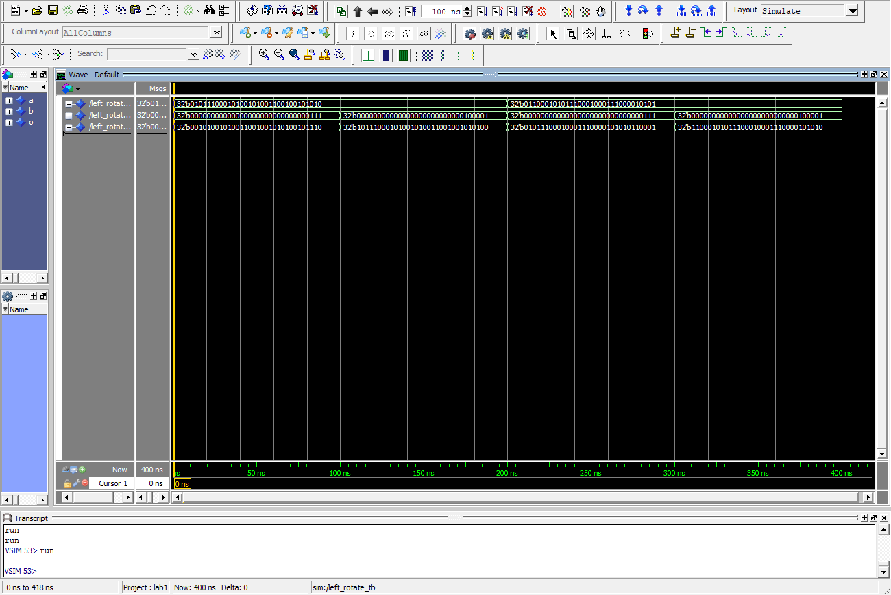
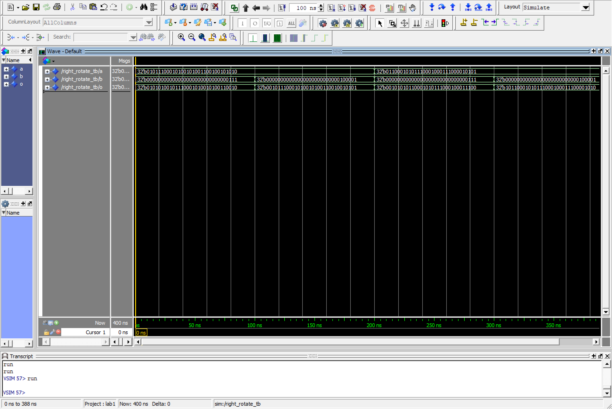
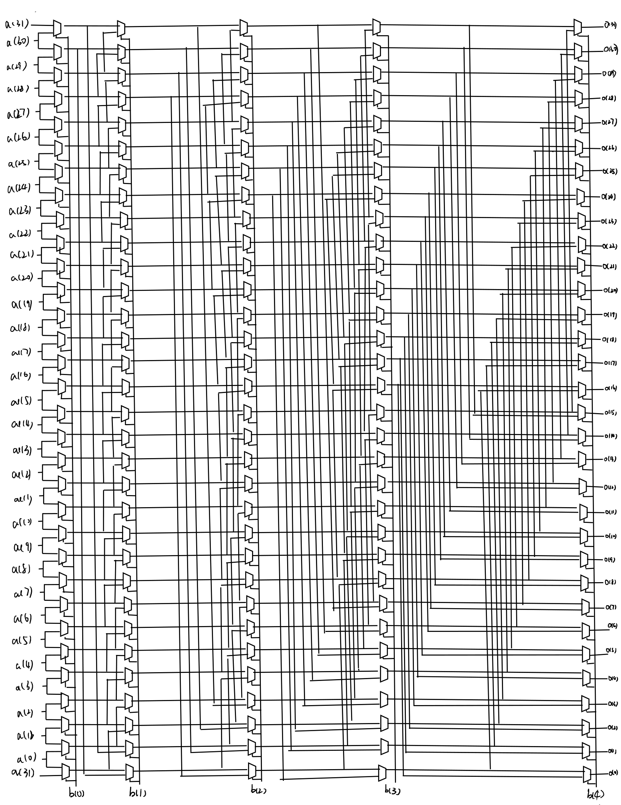
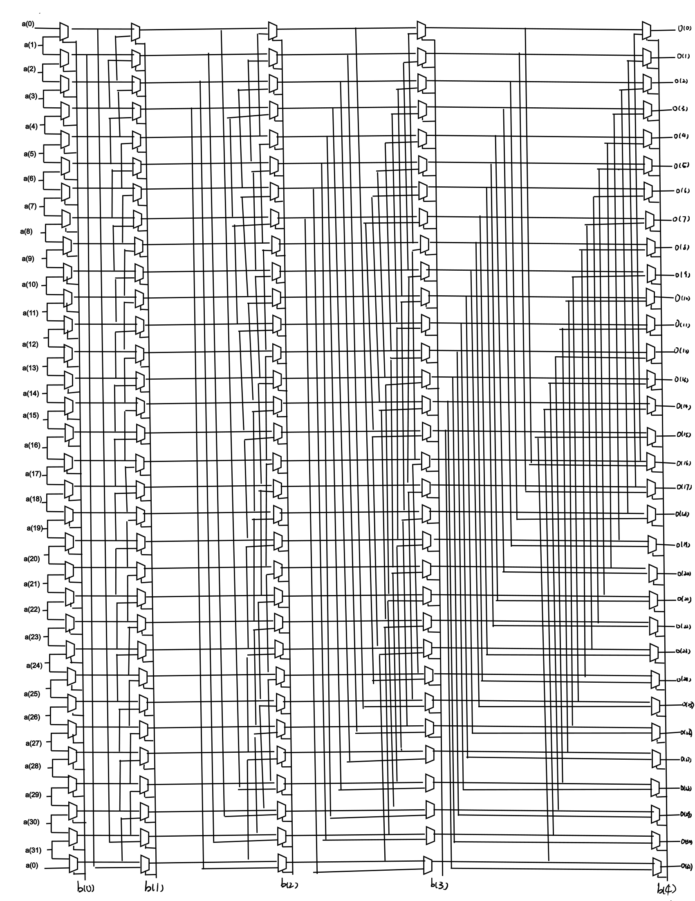

# EL6463 Advanced Hardware Design

## Lab #1

Name: Chen Shen

netID: cs5236

----

### The screen captures of simulations

Left rotate:

Right rotate:

For each case, there are two values of `a`, `01011100010100101001100100101010` and `01100010101110001000111000010101`. For each `a`, there are two values of `b`, `00000000000000000000000000000111` and `00000000000000000000000000100001`. The results of simulation are shown in the figures above.

### Block diagrams

Left rotate:

Right rotate:

First, we can decode `b` into 5 different bits. For each bit, it can represent whtther shift 1, 2, 4, 8, 16 bits or not. The shift bits of output can be represented by the sum of these 5 bits times the corresponding number. Thus, the general diagram is divided into 5 steps. Each step decides shift 1 bit, 2 bits, 4 bits, 8 bits, 16 bits or not. So the output `o` is the input `a` passing these 5 steps.

### Hand calculation steps

For left rotate, when `a` is `01011100010100101001100100101010`, for `b` equals `00000000000000000000000000000111`, which is `7` in decimal, the output `o` should be the same as `a` left rotated by `7` bits. Thus, we have `o` supposed to be `00101001010011001001010100101110`, which is the same as the result of simulation.

Besides, for `b` equals `00000000000000000000000000100001`, which is `33` in decimal, the output `o` should be the same as `a` left rotated by `1` bits. Thus, we have `o` supposed to be `10111000101001010011001001010100`, which is the same as the result of simulation.

In the second case, when `a` is `01100010101110001000111000010101`, for `b` equals `00000000000000000000000000000111`, which is `7` in decimal, the output `o` should be the same as `a` left rotated by `7` bits. Thus, we have `o` supposed to be `01011100010001110000101010110001`, which is the same as the result of simulation.

Besides, for `b` equals `00000000000000000000000000100001`, which is `33` in decimal, the output `o` should be the same as `a` left rotated by `1` bits. Thus, we have `o` supposed to be `11000101011100010001110000101010`, which is the same as the result of simulation.

For right rotate, when `a` is `01011100010100101001100100101010`, for `b` equals `00000000000000000000000000000111`, which is `7` in decimal, the output `o` should be the same as `a` left rotated by `7` bits. Thus, we have `o` supposed to be `01010100101110001010010100110010`, which is the same as the result of simulation.

Besides, for `b` equals `00000000000000000000000000100001`, which is `33` in decimal, the output `o` should be the same as `a` left rotated by `1` bits. Thus, we have `o` supposed to be `00101110001010010100110010010101`, which is the same as the result of simulation.

In the second case, when `a` is `01100010101110001000111000010101`, for `b` equals `00000000000000000000000000000111`, which is `7` in decimal, the output `o` should be the same as `a` left rotated by `7` bits. Thus, we have `o` supposed to be `00101010110001010111000100011100`, which is the same as the result of simulation.

Besides, for `b` equals `00000000000000000000000000100001`, which is `33` in decimal, the output `o` should be the same as `a` left rotated by `1` bits. Thus, we have `o` supposed to be `10110001010111000100011100001010`, which is the same as the result of simulation.

### Demo Video

<https://youtu.be/jWPmraAObeY>