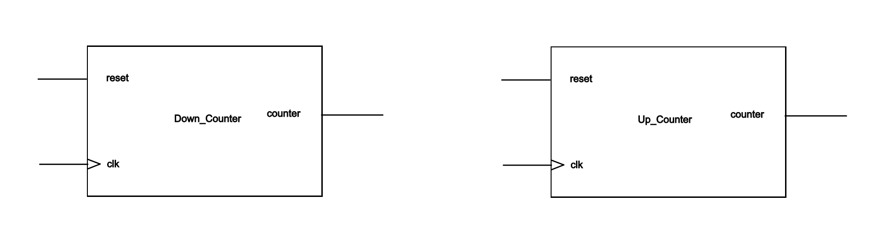
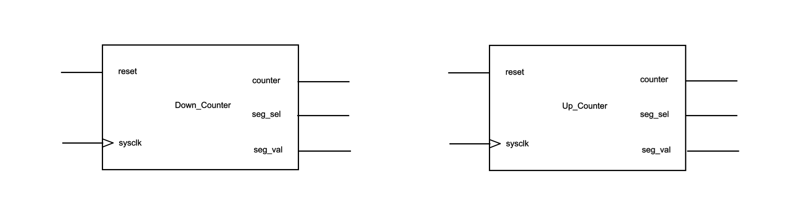

# EL6463 Advanced Hardware Design

## Lab #3

Name: Chen Shen

netID: cs5236

----

## Block diagram

In the above shows the basic block diagrams of a down counter and an up counter.

This second figure shows more details of the particular design. In this case, the signal `clk` has been changed to a new signal `sysclk`, which represents the high-frequency FPGA clock. Inside the block, there is a divider to generate a low-frequency signal `clk`. In my design, the `sysclk` has a period of `10ns`, and `clk` has a period of `1s`. Besides, there are two more output signals named `seg_sel` and `seg_val`. The signal `seg_sel` is corresponding to the segment display to use. Remember that the segment displays are low level effective. For example, if I want to use the first right-handed segment display, `seg_sel` would be `1111110`. The signal `seg_val` decides which segments will be lit. Notice that the seven segments are common anode. More specifically, a `0` represents for lit.

Notice that this diagram only includes the IO of a counter. We can use D flip-flop or JK flip-flop to implement a counter in gate level.

## Functional and timing simulation

### Down Counter

### Up Counter

Since I have added a frequecy divider into the design, if we want to get a simulation of full function of the design, it needs a simulation of around 100 second, which really takes a long time and enormous computing resources to do the simulation. Thus, when doing the simulation, I deleted the frequency divider part and use a signal with a period of 10ns as the input signal `clk` to show the main funcions of the counters.

Notice that in my test bench, I have already initialized signal `reset` to `0`. Thus, I can set the signal `reset` to `1` at the very beginning.

From the figures above, we can see that the two counter keep counting up/down at each positive edge of clock signal `clk`. Each counter counts from one pre-set value to the other pre-set value (in this lab, from `52` to `36` or from `36` to `52`). Besides, when the signal `reset` is set to `0`, the output `counter` will be reset to the intial value (`52` or `36`).

## Resource utilization

Since the down counter shares a common basic architecture with the up counter, they have the same resource utilization.

|                              | Synthesis stage | Place and Route stage |
| :--------------------------- | :-------------- | :-------------------: |
| LUT and FF pairs usage       | 45              | 26                    |
| IOB usage                    | 24              | 24                    |
| RAM/DSP blocks used (if any) | 0               | 0                     |

## Speed of the design

### Down counter

| Setup                        |          | Hold                         |          | Pulse Width                              |          |
| :--------------------------- | :------- | :--------------------------- | :------- | :--------------------------------------- | :------- |
| Worst Negative Slack (WNS):  | 5.661 ns | Worst Hold Slack (WHS):      | 0.264 ns | Worst Pulse Width Slack (WPWS):          | 4.500 ns |
| Total Negative Slack (TNS):  | 0.000 ns | Total Hold Slack (THS):      | 0.000 ns | Total Pulse Width Negative Slack (TPWS): | 0.000 ns |
| Number of Falling Endpoints: | 0        | Number of Falling Endpoints: | 0        | Number of Falling Endpoints:             | 0        |
| Total Number of Endpoints    | 39       | Total Number of Endpoints    | 39       | Total Number of Endpoints                | 40       |

### Up counter

| Setup                        |          | Hold                         |          | Pulse Width                              |          |
| :--------------------------- | :------- | :--------------------------- | :------- | :--------------------------------------- | :------- |
| Worst Negative Slack (WNS):  | 5.743 ns | Worst Hold Slack (WHS):      | 0.237 ns | Worst Pulse Width Slack (WPWS):          | 4.500 ns |
| Total Negative Slack (TNS):  | 0.000 ns | Total Hold Slack (THS):      | 0.000 ns | Total Pulse Width Negative Slack (TPWS): | 0.000 ns |
| Number of Falling Endpoints: | 0        | Number of Falling Endpoints: | 0        | Number of Falling Endpoints:             | 0        |
| Total Number of Endpoints    | 39       | Total Number of Endpoints    | 39       | Total Number of Endpoints                | 40       |

## Next step

Based on my codes for this lab, there are still some points that can be better.

First of all, another frequency divider can be provided to generate a clock signal which is used to control the segment display. If so, when the `reset` signal is set to `0`, the segment display can still show every number.

In addition, another program or process should be create to convert the output `counter` signal from binary bits to decimal numbers. Besides, I could use the codes in lab2 as a component, and add the extra parts to it. Code reuse can be an important trick to improve efficiency, not only when programming, but also when executing.

Also, with the codes become more and more, I should write more comments in the codes to improve the code readability. The best codes is also a menu.

## Demo video

<https://youtu.be/eXTEZ6obmaw>

*Please notice that the basic architecture of up counter and down counter are the same, so they share a single `.xdc` file.