# EL6463 Advanced Hardware Design

## Lab #4

Name: Chen Shen

netID: cs5236

----

## Test Cases

In my test bench, I used 3 `din` for encryption and decryption.

`din` = `x"0000000000000000"`

`din` = `x"0123456789abcdef"`

`din` = `x"ffffffffffffffff"`

## Hand Calculation

### Encryption: `din` = `x"0000000000000000"`

Before the main loop, we have `A` = `x"00000000"` and `B` = `x"00000000"`.

In the first loop, after the first line, we have `A` = `x"46f8e8c5"`. After the second line, we have `B` = `x"2529792d"`.

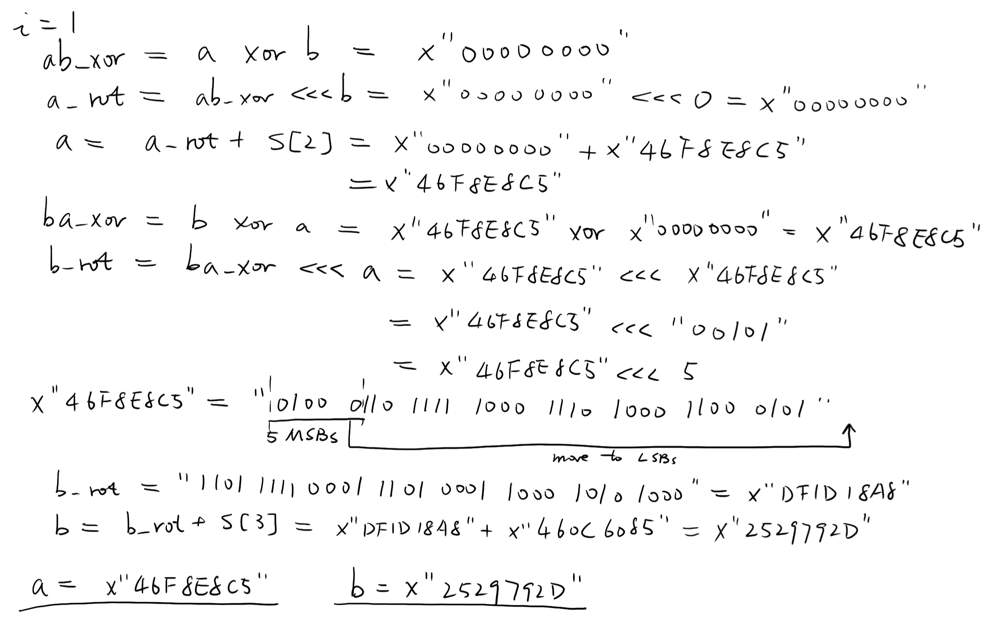

In the second loop, after the first line, we have `A` = `x"a3354804"`. After the second line, we have `B` = `x"8a0e959b"`.

In the third loop, after the first line, we have `A` = `x"4a87f340"`. After the second line, we have `B` = `x"b6ab53fd"`.

### Decryption: `din` = `x"0000000000000000"`

Before the main loop, we have `A` = `x"00000000"` and `B` = `x"00000000"`.

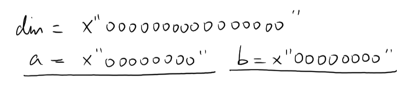

In the first loop, after the first line, we have `A` = `x"93c8774f"`. After the second line, we have `B` = `x"9afb9c80"`.

In the second loop, after the first line, we have `A` = `x"e99c86aa"`. After the second line, we have `B` = `x"6130d88b"`.

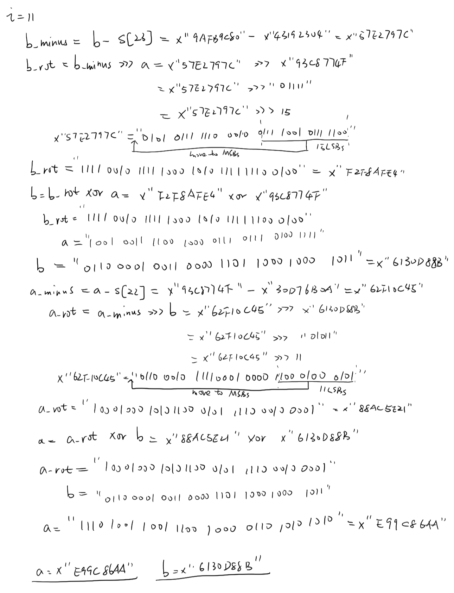

In the third loop, after the first line, we have `A` = `x"4987f97f"`. After the second line, we have `B` = `x"20b04007"`.

## Block Diagram

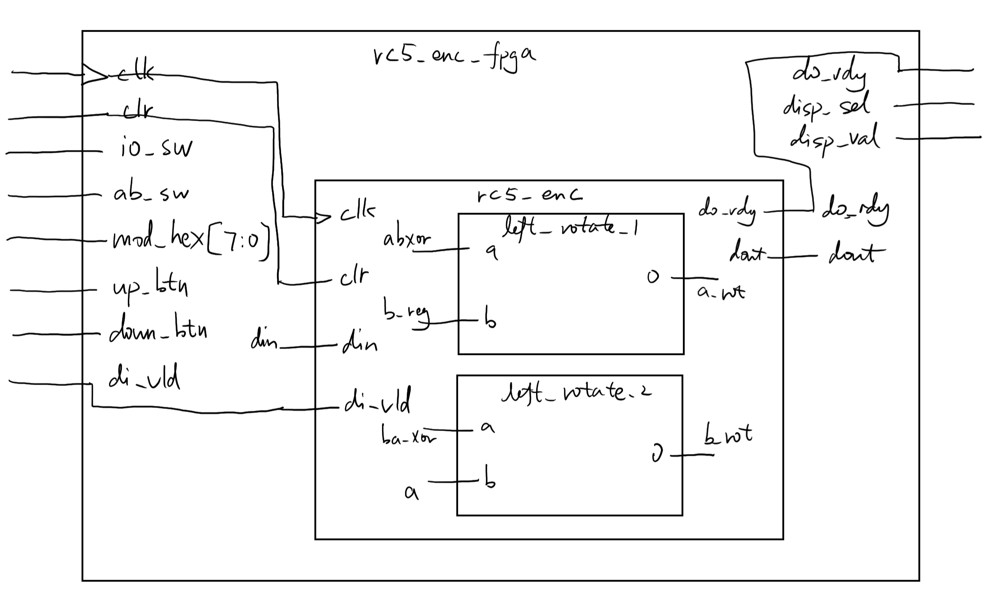

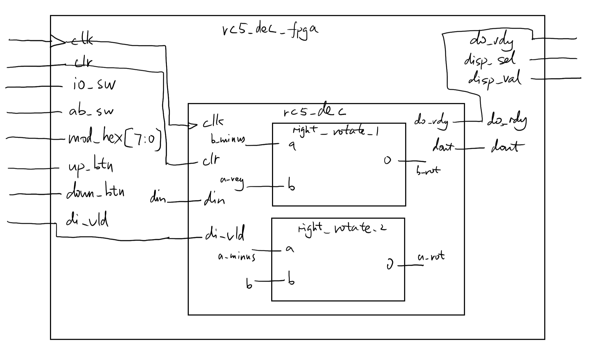

## Resource Utilization

### RC5 Encryption

|                              | Synthesis stage      | Place and Route stage |
| :--------------------------- | :------------------- | :-------------------: |
| LUT and FF pairs usage       | 510 LUTs and 230 FFs | 186                   |
| IOB usage                    | 32                   | 32                    |
| RAM/DSP blocks used (if any) | 0                    | 0                     |

### RC5 Decryption

|                              | Synthesis stage      | Place and Route stage |
| :--------------------------- | :------------------- | :-------------------: |
| LUT and FF pairs usage       | 390 LUTs and 230 FFs | 131                   |
| IOB usage                    | 32                   | 32                    |
| RAM/DSP blocks used (if any) | 0                    | 0                     |

## Simulation

*Notice that all the simulations use the same clock peroid - 20 ns

### Functional Simulation

*In post-implementation simulation, the `a_reg`, `b_reg`, `a` and `b` are compiled to a lot of `wire`s. So only some of these signals can be added to wave window.

#### RC5 Encryption

##### `din` = `x"0000000000000000"`

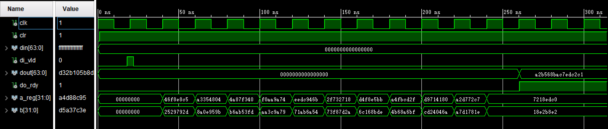

##### `din` = `x"0123456789abcdef"`

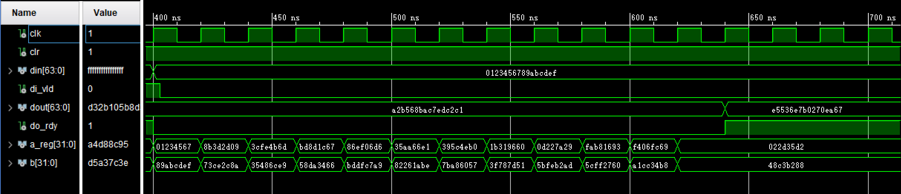

##### `din` = `x"ffffffffffffffff"`

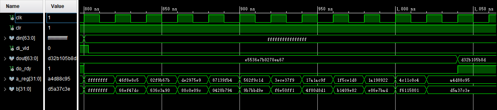

#### RC5 Decryption

##### `din` = `x"0000000000000000"`

##### `din` = `x"0123456789abcdef"`

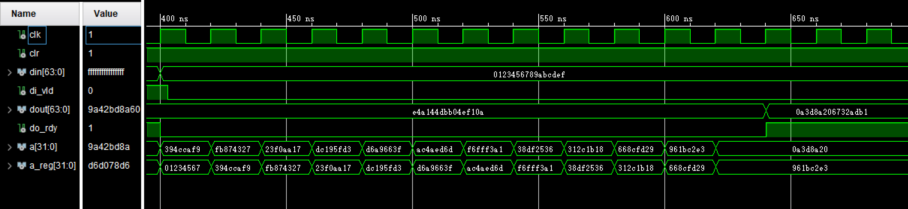

##### `din` = `x"ffffffffffffffff"`

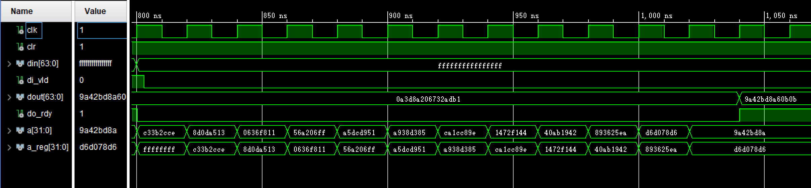

### Timing Simulation

#### RC5 Encryption

##### `din` = `x"0000000000000000"`

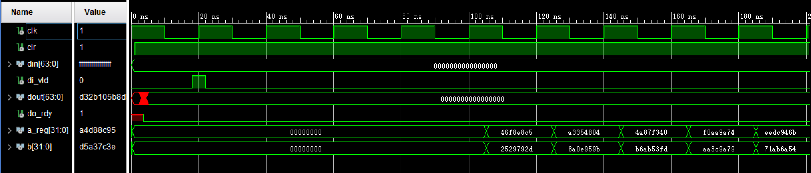

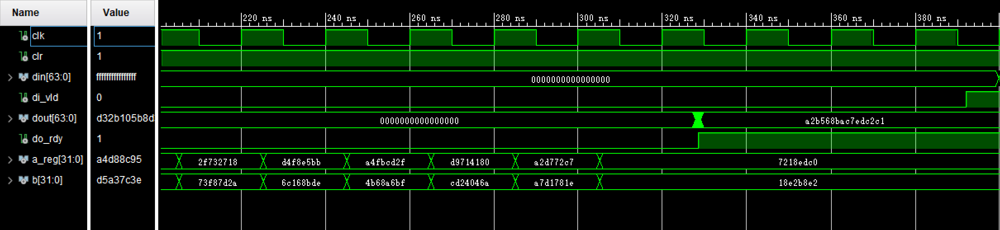

##### `din` = `x"0123456789abcdef"`

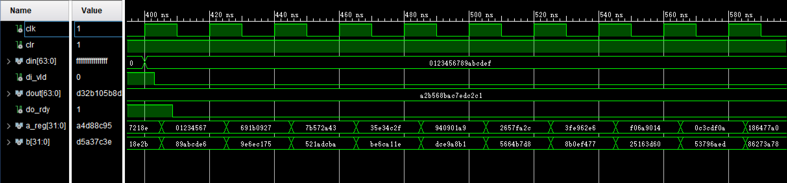

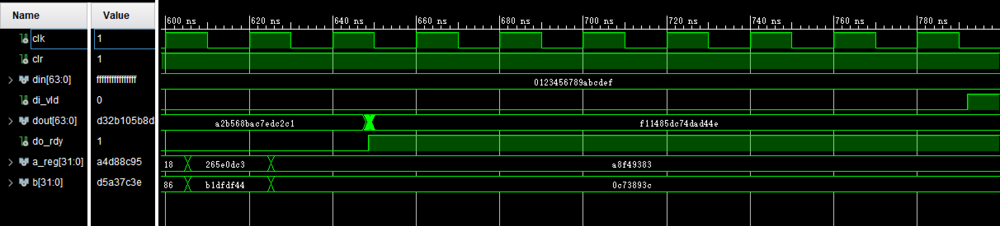

##### `din` = `x"ffffffffffffffff"`

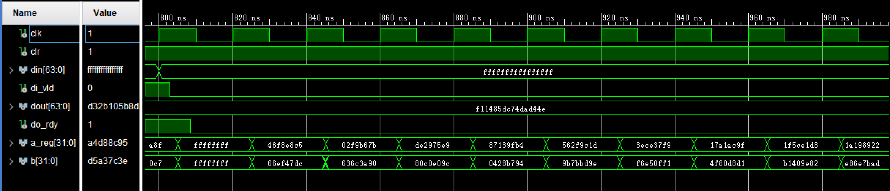

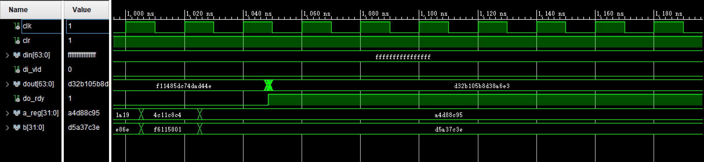

#### RC5 Decryption

##### `din` = `x"0000000000000000"`

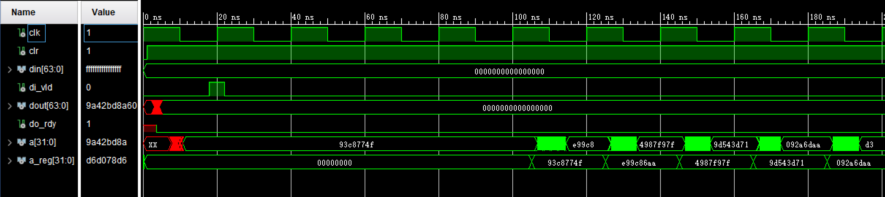

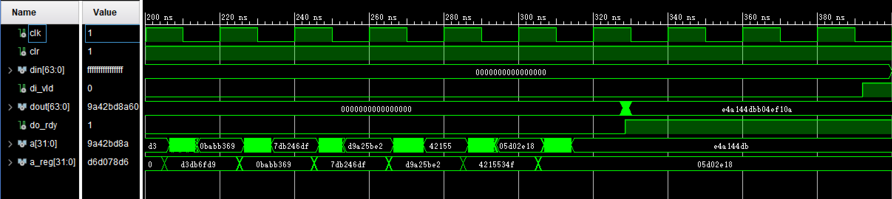

##### `din` = `x"0123456789abcdef"`

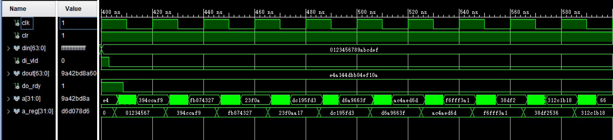

##### `din` = `x"ffffffffffffffff"`

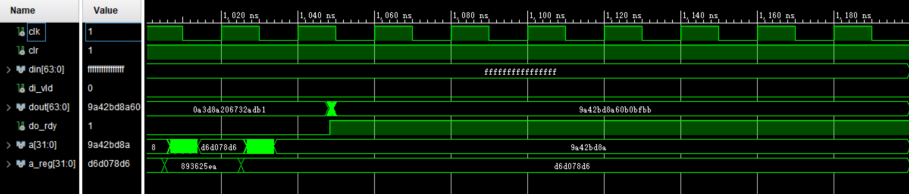

## Speed of the Design

*Remember that in Vivado, only WNS (Worst Negative Slack) is provided in the report, which represents the max delay path (required time - arrival time). In my design, I used a clock signal having a period of 20 ns. So the requirement was 20 ns, and the slack is `WNS` (note that it is positive), which means that we could have asked for a clock period `WNS` shorter and it would still be fine. Thus we can answer the minimum period and maximal frequency through this way. (I found this explanation on <http://bilauer.co.il/blog/2017/01/vivado-minimal-period-timing/>)

### RC5 Encryption

| Setup                        |          | Hold                         |          | Pulse Width                              |          |
| :--------------------------- | :------- | :--------------------------- | :------- | :--------------------------------------- | :------- |
| Worst Negative Slack (WNS):  | 6.516 ns | Worst Hold Slack (WHS):      | 0.210 ns | Worst Pulse Width Slack (WPWS):          | 9.500 ns |
| Total Negative Slack (TNS):  | 0.000 ns | Total Hold Slack (THS):      | 0.000 ns | Total Pulse Width Negative Slack (TPWS): | 0.000 ns |
| Number of Falling Endpoints: | 0        | Number of Falling Endpoints: | 0        | Number of Falling Endpoints:             | 0        |
| Total Number of Endpoints    | 412      | Total Number of Endpoints    | 412      | Total Number of Endpoints                | 219      |

Minimum period: 13.484 ns

Maximum clock frequency: 74.162 MHz

Latency: 12 clock cycles

### RC5 Decryption

| Setup                        |          | Hold                         |          | Pulse Width                              |          |
| :--------------------------- | :------- | :--------------------------- | :------- | :--------------------------------------- | :------- |
| Worst Negative Slack (WNS):  | 9.005 ns | Worst Hold Slack (WHS):      | 0.105 ns | Worst Pulse Width Slack (WPWS):          | 9.500 ns |
| Total Negative Slack (TNS):  | 0.000 ns | Total Hold Slack (THS):      | 0.000 ns | Total Pulse Width Negative Slack (TPWS): | 0.000 ns |
| Number of Falling Endpoints: | 0        | Number of Falling Endpoints: | 0        | Number of Falling Endpoints:             | 0        |
| Total Number of Endpoints    | 413      | Total Number of Endpoints    | 413      | Total Number of Endpoints                | 219      |

Minimum period: 10.995 ns

Maximum clock frequency: 90.950 MHz

Latency: 12 clock cycles

## Port Map

### Clock Signal

First, I generated a **clock signal** with period 20 ns, and mapped the clock signal `clk` (logic bit) in my design to it.

Because the hardware needs time to deal with the data in each clock cycle, if we use a too small period, for example, 10 ns, the time will be not enough to cover all the computations in each clock cycle. So we need set the clock cycle properly.

### Buttons

In my design, 3 buttons (reset, up, down and center) are used.

The reset signal `clr` (logic bit) is mapped to **CPU reset button**, which serves as an asynchronous reset signal. When clicking on reset button, the signals including input (`din`), output (`dout`), registers (`a_reg` and `b_reg`) and some intermediate signals (`i_cnt`, `do_rdy`, .etc) will be initialized with a certain value (generally 0). Notice that the reset signal is low level effective. That is why it must be mapped to the CPU Reset button.

The signals `up_btn` (logic bit) and `down_btn` (logic bit) are mapped to **up button** and **down button**, which are used to modify the value of input vector. When clicking on up button, the displaying 8-bit hexadecimal number will increase by 1. Similarly, when clicking on down button, the displaying 8-bit hexadecimal number will decrease by 1. These two button only work when the input vector is being displayed. In addition, in order to avoid continued increasing/decreasing, I used a buffer signal for each button. By checking the value of button and the corresponding buffer at every clock rising edge, I can decide the rising edge of button signal is within which clock cycle. Thus, the function will be triggered only once at a time. Also, thanks to the high frequency clock signal, the delay cannot be detected by us human beings.

**Center button** is mapped to the signal `di_vld`, which is used to tell the system that input value is ready and computation can take place.

### Switches

In my design, 10 switches (I/O switch, A/B switch, and 8 switches to decide the modifying bits) are used.

The signal `io_sw` (logic bit) is mapped to the first right-handed switch (**I/O switch**). This switch is used to switch the display (on 7 segments) between input vector and output vector.

The signal `ab_sw` (logic bit) is mapped to the second right-handed switch (**A/B switch**). This switch is used to switch the display (on 7 segments) between vector `A` (32 most significant bits) and vector `B` (32 least significant bits).

The signal `mod_hex` (8-bit logic vector) is mapped to 8 switches (**modifying switch**). Each bit of the vector corresponds to a certain segment. When modifying the hexadecimal value with the two buttons mentioned above, only the segments of which the corresponding switch is set to `1` will change.

### LEDs

In my design, only one LED is used.

The signal `do_rdy` is mapped to the first left-handed LED. When output is ready, the LED will be on. Or it remains off.

### 7 Segment Display

In my design, all 7 segment display are used.

The current displaying value are determined by the two switch mentioned above (**I/O switch** and **A/B switch**).

In order to perform a proper function of displaying, I generate a slow clock, comparing with the clock `clk` (20 ns period). This clock signal for 7 segment display has a period of 20 * 2^16 ns and it is used to switch among all the 8 digits. At the rising edge of display clock signal (`disp_clk(15)`), the anode select (signal `seg_sel`) and corresponding value to be displayed (signal `seg_val`) will change. As a result, we can get a suitable refresh rate. With this rate, the 8 digits can be different and no overlapping occurs.

### Brief Summary

By modifying the `.xdc` file, we can set the period of clock signal. In this way, each divide by two will use a flip-flop to implement. However, the number of flip-flop which can be used as frequency divider is limited. So the clock period can only be changed within a certain range. If we want a really slow clock, for example, a period of 1 sec. It can not be realized directly by flip-flop hardware. Thus, we need to declare a vector as counter to count the number of rising edges of clock signal.

The most significant difference between buttons and switches is that the switches have two stable states (`0` and `1`) while the buttons only have one (`0`). That's why I used buttons as triggers for each function and used switches to represent different states or modes.

There are 8 digits of 7 segment display but only 16 LEDs. As we all know, each digit of 7 segment display can show one bit of hexadecimal number, which takes 4 binary bits. 32 binary bits can be displayed at a time with 8 hexadecimal bits. So I chose to use 7 segment display to show the long vector (64 logic bits). Besides, the LEDs are used as indecators.

For more details, please go over my VHDL codes.

## Demo Video

<https://youtu.be/oqQJlu5xBXE>