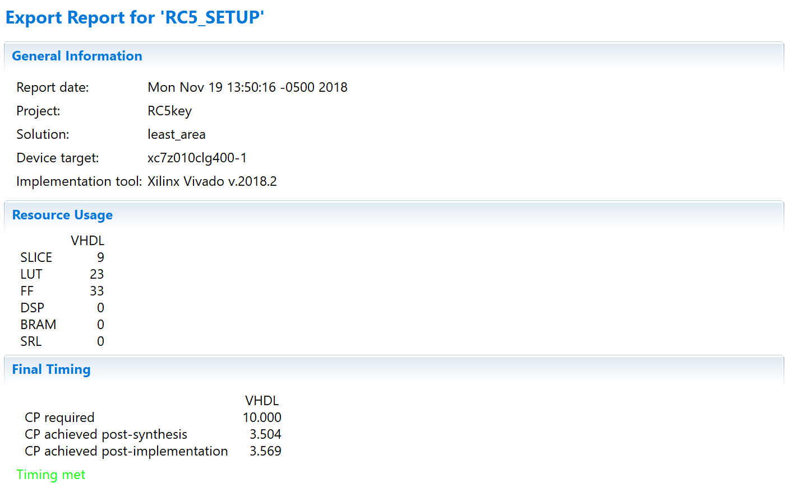
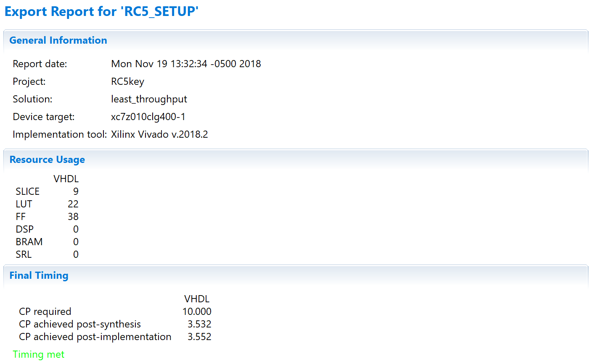
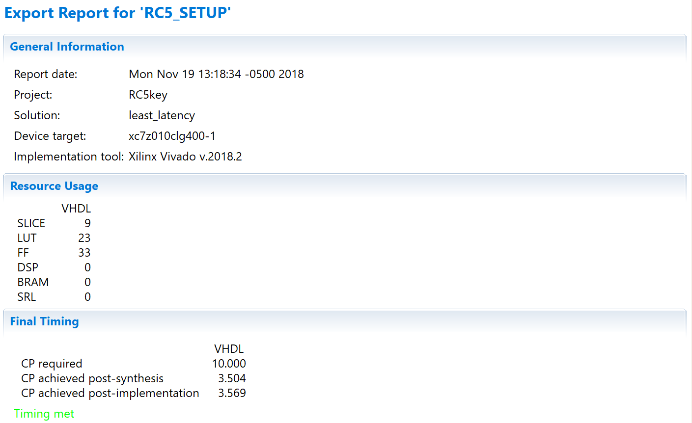
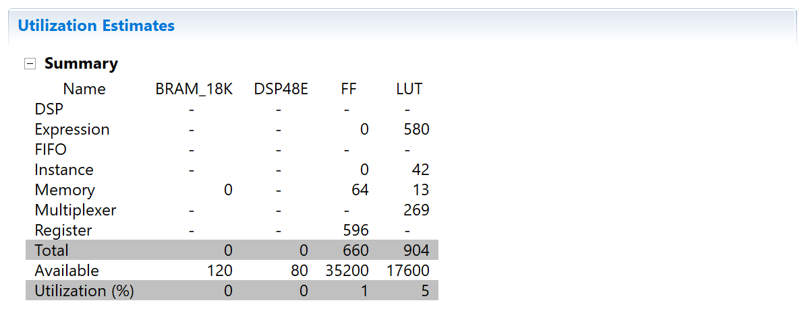
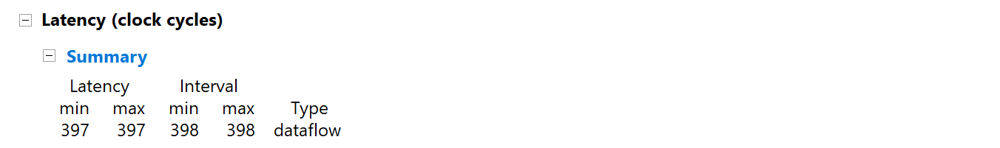
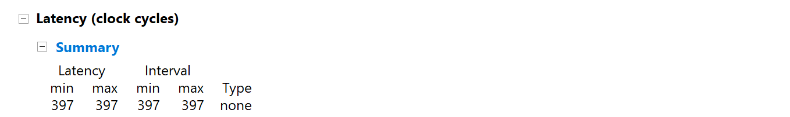

# EL6463 Advanced Hardware Design

## Lab #6

Name: Chen SHEN

netID: cs5236

----

## Result of 10 Different Inputs

### Case 1

```text
key = 00 00 00 00 00 00 00 00 00 00 00 00 00 00 00 00
Round Key  0 = 9BBBD8C8
Round Key  1 = 1A37F7FB
Round Key  2 = 46F8E8C5
Round Key  3 = 460C6085
Round Key  4 = 70F83B8A
Round Key  5 = 284B8303
Round Key  6 = 513E1454
Round Key  7 = F621ED22
Round Key  8 = 3125065D
Round Key  9 = 11A83A5D
Round Key 10 = D427686B
Round Key 11 = 713AD82D
Round Key 12 = 4B792F99
Round Key 13 = 2799A4DD
Round Key 14 = A7901C49
Round Key 15 = DEDE871A
Round Key 16 = 36C03196
Round Key 17 = A7EFC249
Round Key 18 = 61A78BB8
Round Key 19 = 3B0A1D2B
Round Key 20 = 4DBFCA76
Round Key 21 = AE162167
Round Key 22 = 30D76B0A
Round Key 23 = 43192304
Round Key 24 = F6CC1431
Round Key 25 = 65046380
```

### Case 2

```text
key = 00 00 00 00 00 00 00 00 00 00 00 00 00 00 00 1F
Round Key  0 = 6501BC11
Round Key  1 = 793F827E
Round Key  2 = 1D18E824
Round Key  3 = B1E0A335
Round Key  4 = FF970FC9
Round Key  5 = C771855C
Round Key  6 = 20839AFE
Round Key  7 = 9EF5D4E0
Round Key  8 = 5F4DC123
Round Key  9 = E2070BE1
Round Key 10 = 6860D38C
Round Key 11 = 021D6D7D
Round Key 12 = AD56EDB3
Round Key 13 = 76C357CD
Round Key 14 = 5B58D9D6
Round Key 15 = 27690FD8
Round Key 16 = 78AF8E97
Round Key 17 = 18A6AA5E
Round Key 18 = FBC5A1CC
Round Key 19 = 5998D9C3
Round Key 20 = 6A3656FA
Round Key 21 = 8B16FCAA
Round Key 22 = FF347314
Round Key 23 = B0DBC5D6
Round Key 24 = 98E27A14
Round Key 25 = BACDE397
```

### Case 3

```text
key = 00 00 00 00 00 00 00 00 00 00 00 00 00 00 00 3B
Round Key  0 = C7B98806
Round Key  1 = B746ACE8
Round Key  2 = 400BBEF2
Round Key  3 = 2EEB50EB
Round Key  4 = 3DB7BFD0
Round Key  5 = 2352322E
Round Key  6 = B4789250
Round Key  7 = BD7AD0C6
Round Key  8 = 4958751D
Round Key  9 = 87B7A6A7
Round Key 10 = 214E5CBA
Round Key 11 = 907015F0
Round Key 12 = EE34A6A2
Round Key 13 = 9961AD27
Round Key 14 = C4C3AD93
Round Key 15 = 726356AB
Round Key 16 = C9164AA3
Round Key 17 = 68C3D39A
Round Key 18 = E0A5359A
Round Key 19 = D97898E4
Round Key 20 = 25C58B3E
Round Key 21 = 5CF8675F
Round Key 22 = 60CD777F
Round Key 23 = C6A2C36F
Round Key 24 = 2F10F7F9
Round Key 25 = E74598B5
```

### Case 4

```text
key = 00 00 00 00 00 00 00 00 00 00 00 00 FF FF 00 00
Round Key  0 = 6214743A
Round Key  1 = C2E3116D
Round Key  2 = 3FE4CE34
Round Key  3 = AE08F8FE
Round Key  4 = 72EB8DEF
Round Key  5 = 0F66B7C3
Round Key  6 = 65BB7EEF
Round Key  7 = 25154FBD
Round Key  8 = A0965493
Round Key  9 = 0CA3DFA8
Round Key 10 = 6C7AB602
Round Key 11 = 4A184929
Round Key 12 = D6CC4B19
Round Key 13 = C257E1EA
Round Key 14 = DA5DF20A
Round Key 15 = 6311A096
Round Key 16 = E541EF63
Round Key 17 = 82CB1BF1
Round Key 18 = 4F0B77D8
Round Key 19 = 5A36AFF1
Round Key 20 = 545259BB
Round Key 21 = BA8D7FDE
Round Key 22 = FAB9E7F2
Round Key 23 = 86017B38
Round Key 24 = 2CF8BA3D
Round Key 25 = 21C062AC
```

### Case 5

```text
key = 00 00 00 00 00 00 00 00 00 00 00 00 F0 F0 F0 F0
Round Key  0 = D33C8428
Round Key  1 = 1AA9A8A5
Round Key  2 = AA24447E
Round Key  3 = 39EE920D
Round Key  4 = 68EDEE9A
Round Key  5 = B4BFEC87
Round Key  6 = 12C9A5CE
Round Key  7 = 2F489E57
Round Key  8 = 53A4B671
Round Key  9 = 3CB91434
Round Key 10 = 11359497
Round Key 11 = 53B3DF40
Round Key 12 = 6421A258
Round Key 13 = 8B324DD6
Round Key 14 = 83E446EF
Round Key 15 = 0E69C38C
Round Key 16 = AA330E03
Round Key 17 = 9C6CD690
Round Key 18 = D8C9F63D
Round Key 19 = 52995624
Round Key 20 = F40BB795
Round Key 21 = DA314BA7
Round Key 22 = 1D00E01F
Round Key 23 = 194C49D6
Round Key 24 = 3D5EEE10
Round Key 25 = 7EE333AF
```

### Case 6

```text
key = 00 00 00 00 00 00 00 00 00 00 00 00 F0 F0 11 11
Round Key  0 = DB9E85A4
Round Key  1 = 2BCB55B0
Round Key  2 = 42A5EEA3
Round Key  3 = EFAC8BD3
Round Key  4 = DA2DBB9F
Round Key  5 = 158571C0
Round Key  6 = 4673B8BB
Round Key  7 = 75185827
Round Key  8 = 27438789
Round Key  9 = 8C916730
Round Key 10 = F650FD7C
Round Key 11 = ED3BBCF8
Round Key 12 = 0FD5B7DE
Round Key 13 = 1C2C856E
Round Key 14 = 75179530
Round Key 15 = 7E0D73F6
Round Key 16 = D9FAB7E5
Round Key 17 = B8786F7F
Round Key 18 = CE067812
Round Key 19 = 8AB395BF
Round Key 20 = E27D0421
Round Key 21 = FDB35586
Round Key 22 = 6F5A7F66
Round Key 23 = 9F7CD320
Round Key 24 = B06A0871
Round Key 25 = 09ECFA1F
```

### Case 7

```text
key = 00 00 00 00 00 00 00 00 00 00 00 00 10 10 10 10
Round Key  0 = B11DFE5F
Round Key  1 = 371229AF
Round Key  2 = D4C05ACB
Round Key  3 = 2843441F
Round Key  4 = 7C9FDC17
Round Key  5 = 6FBA6AC6
Round Key  6 = 5334A4AE
Round Key  7 = 3F355C90
Round Key  8 = 84359717
Round Key  9 = 548C5251
Round Key 10 = 42D9F43F
Round Key 11 = F004E816
Round Key 12 = 9C5B15CD
Round Key 13 = F234D434
Round Key 14 = 71F0E520
Round Key 15 = 3769FA67
Round Key 16 = 7CD49D87
Round Key 17 = 98928D94
Round Key 18 = 08BE1E42
Round Key 19 = ED582054
Round Key 20 = 0F8E7B29
Round Key 21 = 3AFF919E
Round Key 22 = 201EEE7C
Round Key 23 = 7B44AD81
Round Key 24 = 11E8C14C
Round Key 25 = 4514641B
```

### Case 8

```text
key = 00 00 00 00 00 00 00 00 00 00 00 00 10 10 FF FF
Round Key  0 = 27AAE1D8
Round Key  1 = 981388C6
Round Key  2 = D38928E7
Round Key  3 = 903150AD
Round Key  4 = 6591C338
Round Key  5 = 082D90F6
Round Key  6 = A805CFA8
Round Key  7 = 501FD002
Round Key  8 = CF44A1B8
Round Key  9 = E045924D
Round Key 10 = 3E0600BF
Round Key 11 = C0DF6CCB
Round Key 12 = D0E262D5
Round Key 13 = 0C7C0BC3
Round Key 14 = E7482439
Round Key 15 = 6AF656BE
Round Key 16 = 8977BB8B
Round Key 17 = 2F4720AD
Round Key 18 = 404FBC38
Round Key 19 = EDE68DB6
Round Key 20 = D91F52DB
Round Key 21 = 46C6D2A3
Round Key 22 = 5A3B981B
Round Key 23 = 420C24E7
Round Key 24 = CD171EA3
Round Key 25 = BFF78DC2
```

### Case 9

```text
key = 00 00 00 00 00 00 00 00 00 00 00 00 10 10 F0 00
Round Key  0 = C95277EB
Round Key  1 = BC5B5E60
Round Key  2 = DA7C54CA
Round Key  3 = 7F0119B1
Round Key  4 = 2B9F5C1E
Round Key  5 = 57E91117
Round Key  6 = C39723AF
Round Key  7 = 7ACAA636
Round Key  8 = 4B0F9A9E
Round Key  9 = EF127CBB
Round Key 10 = 3A3927D6
Round Key 11 = 88BBF1F4
Round Key 12 = 838ED3B0
Round Key 13 = 08CC2514
Round Key 14 = E407282E
Round Key 15 = 57B51C7C
Round Key 16 = E51A72C7
Round Key 17 = CEB31F8F
Round Key 18 = A9BB8488
Round Key 19 = 9C16C544
Round Key 20 = E16E3E39
Round Key 21 = 5FD03B6C
Round Key 22 = AD61F237
Round Key 23 = 103E297F
Round Key 24 = 8038A9B5
Round Key 25 = 15AF0CE5
```

### Case 10

```text
key = 00 00 00 00 00 00 00 00 00 00 00 00 FF FF FF FF
Round Key  0 = B3403A33
Round Key  1 = CDC1A033
Round Key  2 = 9F6D7AE0
Round Key  3 = 3053FC1D
Round Key  4 = 2C9161B6
Round Key  5 = 761F3539
Round Key  6 = 582F75BD
Round Key  7 = 1C1B9E9D
Round Key  8 = 634A4E57
Round Key  9 = 2A50B2B4
Round Key 10 = 822A06A6
Round Key 11 = 0C6BD9F0
Round Key 12 = CF64C870
Round Key 13 = 46696E65
Round Key 14 = 31F74111
Round Key 15 = B11E761C
Round Key 16 = F4D8F872
Round Key 17 = 5A9B7949
Round Key 18 = C2704DA6
Round Key 19 = 0F59578E
Round Key 20 = 49DB703A
Round Key 21 = 9F0F269C
Round Key 22 = C764BA93
Round Key 23 = 0660FA2B
Round Key 24 = ED067895
Round Key 25 = 1A9703AC
```

## Post-implementation resource usage for each of the solutions

All of the derectives of the three solutions are set according to *21_Improving_Resources.pptx* and *13_Improving_Performance.pptx*.

### Solution `least_area`

This step is according to these slides *21_Improving_Resources.pptx*.



### Solution `least_throughput`

This step is according to these slides *13_Improving_Performance.pptx*.



### Solution `least_latency`

This step is according to these slides *13_Improving_Performance.pptx*.



## Area of solution corresponding to `least_area`



## Thoughput of solution corresponding to `least_throughput`

Notice that without piplining, the throughput is the same as the latency: the next input will be read when the final output is written. (In page 34 of *ug902 vivado high level systhesis*)



## Latency of solution corresponding to `least_latency`



## Could you flatten/merge loops in the design?

No. They cannot be flattened since there is no nested loop. They cannot be merged because the three loops do not have the same loop times and the last one is based on the result of the two previous ones.