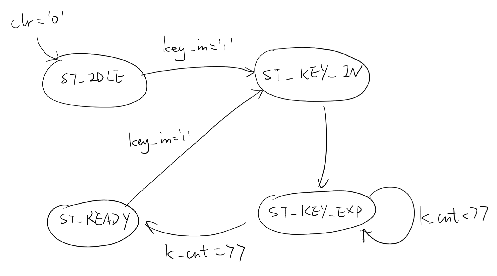
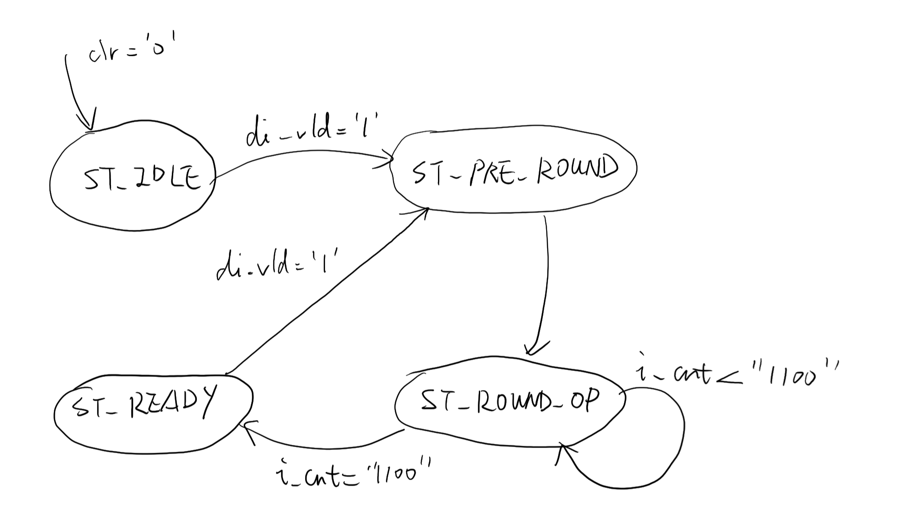
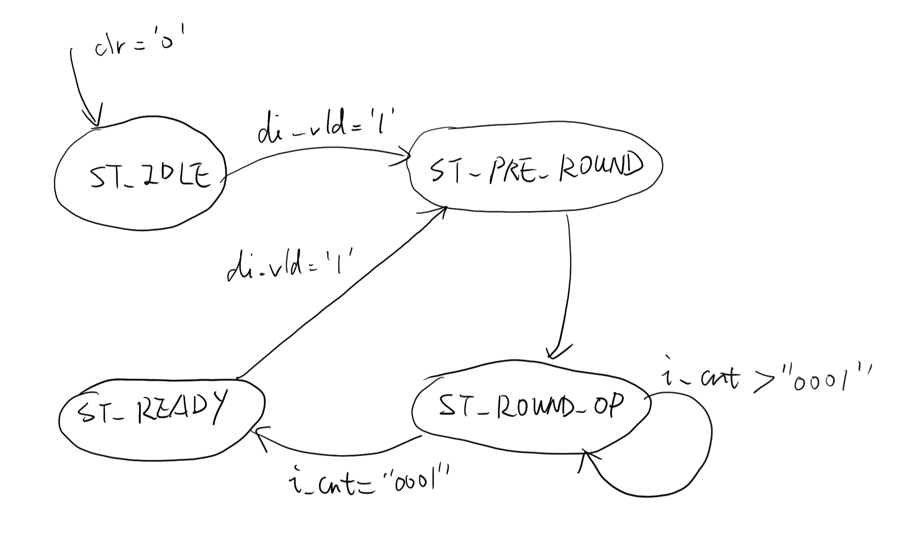

# EL6463 Advanced Hardware Design

## Lab #7

Name: Chen SHEN

netID: cs5236

----

## Block Diagram

## FSM Diagram for Each Component

### key expansion

### RC5 Encryption

### RC5 Decryption

## Simulation

### Whole results

This is a general result of several different cases, followed by more detailed functional and timing simulations.

### Case 1

#### Functional Simulation

#### Timing Simulation

### Case 2

#### Functional Simulation

#### Timing Simulation

### Case 3

#### Functional Simulation

#### Timing Simulation

### Case 4

#### Functional Simulation

#### Timing Simulation

## Resource Utilization

|                              | Synthesis stage        | Place and Route stage |
| :--------------------------- | :--------------------- | :-------------------: |
| LUT and FF pairs usage       | 2009 LUTs and 1315 FFs | 286                   |
| IOB usage                    | 36                     | 36                    |
| RAM/DSP blocks used (if any) | 0                      | 0                     |

## Speed of the Design

*Notice that the clock period is set to be 20 ns.

| Setup                        |          | Hold                         |          | Pulse Width                              |          |
| :--------------------------- | :------- | :--------------------------- | :------- | :--------------------------------------- | :------- |
| Worst Negative Slack (WNS):  | 4.202 ns | Worst Hold Slack (WHS):      | 0.176 ns | Worst Pulse Width Slack (WPWS):          | 9.500 ns |
| Total Negative Slack (TNS):  | 0.000 ns | Total Hold Slack (THS):      | 0.000 ns | Total Pulse Width Negative Slack (TPWS): | 0.000 ns |
| Number of Falling Endpoints: | 0        | Number of Falling Endpoints: | 0        | Number of Falling Endpoints:             | 0        |
| Total Number of Endpoints    | 2576     | Total Number of Endpoints    | 2576     | Total Number of Endpoints                | 1304     |

Minimum period: 15.798 ns

Maximum clock frequency: 63.299 MHz

Latency: 13 clock cycles

## Port Map

### Clock Signal

First, I generated a **clock signal** with period 20 ns, and mapped the clock signal `clk` (logic bit) in my design to it.

Because the hardware needs time to deal with the data in each clock cycle, if we use a too small period, for example, 10 ns, the time will be not enough to cover all the computations in each clock cycle. So we need set the clock cycle properly.

### Buttons

In my design, 3 buttons (reset, up, down and center) are used.

The reset signal `clr` (logic bit) is mapped to **CPU reset button**, which serves as an asynchronous reset signal. When clicking on reset button, the signals including input (`din`), output (`dout`), registers (`a_reg` and `b_reg`) and some intermediate signals (`i_cnt`, `do_rdy`, .etc) will be initialized with a certain value (generally 0). Notice that the reset signal is low level effective. That is why it must be mapped to the CPU Reset button.

The signals `up_btn` (logic bit) and `down_btn` (logic bit) are mapped to **up button** and **down button**, which are used to modify the value of input vector. When clicking on up button, the displaying 8-bit hexadecimal number will increase by 1. Similarly, when clicking on down button, the displaying 8-bit hexadecimal number will decrease by 1. These two button only work when the input vector is being displayed. In addition, in order to avoid continued increasing/decreasing, I used a buffer signal for each button. By checking the value of button and the corresponding buffer at every clock rising edge, I can decide the rising edge of button signal is within which clock cycle. Thus, the function will be triggered only once at a time. Also, thanks to the high frequency clock signal, the delay cannot be detected by us human beings.

**Left button** is mapped to the signal `key_in`, which is used to tell the system that user key is ready and key expansion can take place.

**Right button** is mapped to the signal `di_vld`, which is used to tell the system that input value is ready and computation can take place.

### Switches

In my design, 12 switches (User key switch, I/O switch, A/B switch, Function switch and 8 switches to decide the modifying bits) are used.

The signal `key_sw` (logic bit) is mapped to the first right-handed switch (**User key switch**). This switch is used to switch the display (on 7 segments) between input user key and others.

The signal `io_sw` (logic bit) is mapped to the second right-handed switch (**I/O switch**). This switch is used to switch the display (on 7 segments) between input vector and output vector.

The signal `ab_sw` (logic bit) is mapped to the third right-handed switch (**A/B switch**). This switch is used to switch the display (on 7 segments) between vector `A` (32 most significant bits) and vector `B` (32 least significant bits).

The signal `func_sel` (logic bit) is mapped to the first left-handed switch (**Function switch**). This switch is used to switch the function between encryption and decryption.

The signal `mod_hex` (8-bit logic vector) is mapped to 8 switches (**modifying switch**). Each bit of the vector corresponds to a certain segment. When modifying the hexadecimal value with the two buttons mentioned above, only the segments of which the corresponding switch is set to `1` will change.

### LEDs

In my design, two LEDs are used.

The signal `do_rdy` is mapped to the first left-handed LED. When output is ready, the LED will be on. Or it remains off.

The signal `key_rdy` is mapped to the second left-handed LED. When round keys are ready, the LED will be on. Or it remains off.

### 7 Segment Display

In my design, all 7 segment display are used.

The current displaying value are determined by the switches mentioned above (**User key switch**, **I/O switch** and **A/B switch**).

In order to perform a proper function of displaying, I generate a slow clock, comparing with the clock `clk` (20 ns period). This clock signal for 7 segment display has a period of 20 * 2^16 ns and it is used to switch among all the 8 digits. At the rising edge of display clock signal (`disp_clk(15)`), the anode select (signal `seg_sel`) and corresponding value to be displayed (signal `seg_val`) will change. As a result, we can get a suitable refresh rate. With this rate, the 8 digits can be different and no overlapping occurs.

### Brief Summary

By modifying the `.xdc` file, we can set the period of clock signal. In this way, each divide by two will use a flip-flop to implement. However, the number of flip-flop which can be used as frequency divider is limited. So the clock period can only be changed within a certain range. If we want a really slow clock, for example, a period of 1 sec. It can not be realized directly by flip-flop hardware. Thus, we need to declare a vector as counter to count the number of rising edges of clock signal.

The most significant difference between buttons and switches is that the switches have two stable states (`0` and `1`) while the buttons only have one (`0`). That's why I used buttons as triggers for each function and used switches to represent different states or modes.

There are 8 digits of 7 segment display but only 16 LEDs. As we all know, each digit of 7 segment display can show one bit of hexadecimal number, which takes 4 binary bits. 32 binary bits can be displayed at a time with 8 hexadecimal bits. So I chose to use 7 segment display to show the long vector (64 logic bits). Besides, the LEDs are used as indecators.

For more details, please go over my VHDL codes.

## Demo Video

<https://youtu.be/wSFgVzekZwQ>