# EL6463 Advanced Hardware Design

## Final

Name: Chen Shen

netID: cs5236

----

## FSM Diagram

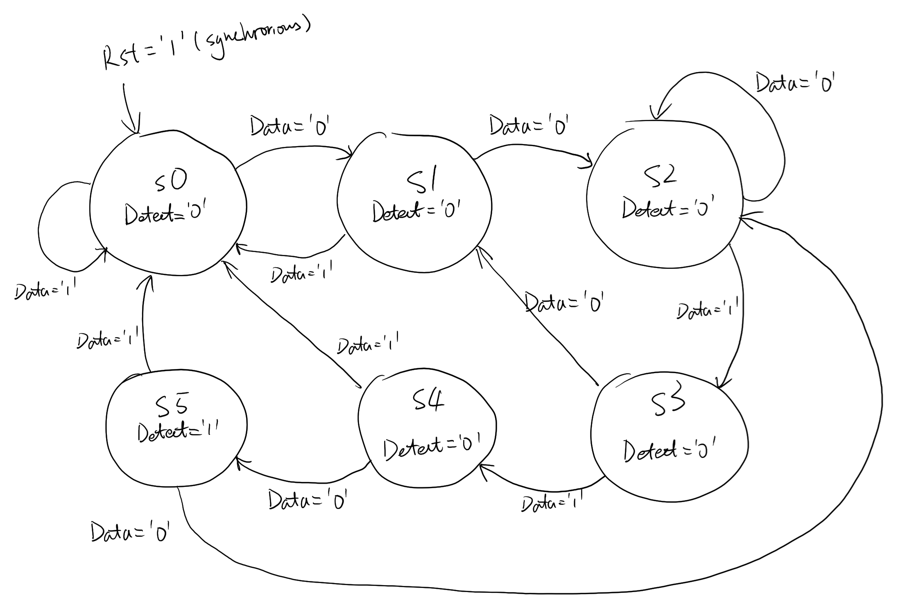

## Corner Cases

### Case 1 (Functional Simulation)

### Case 1 (Timing Simulation)

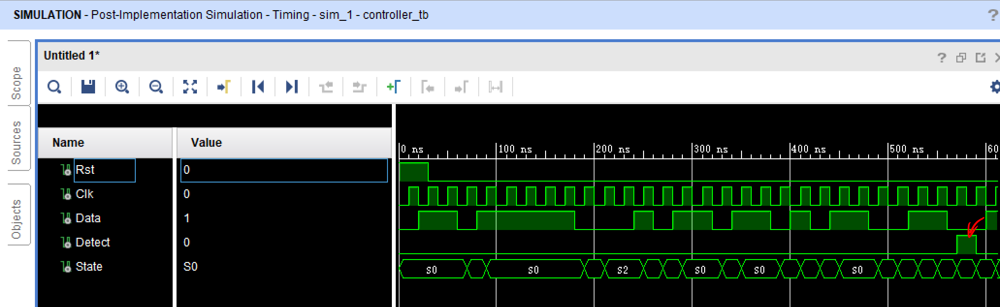

The first case shows the detect function.

As is said in the specification, when a sequence going as '00110' occurs, the signal `Detect` will output a HIGH. Otherwise, its output remains LOW.

### Case 2 (Functional Simulation)

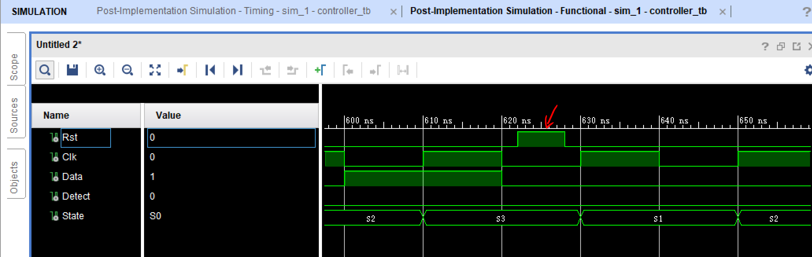

### Case 2 (Timing Simulation)

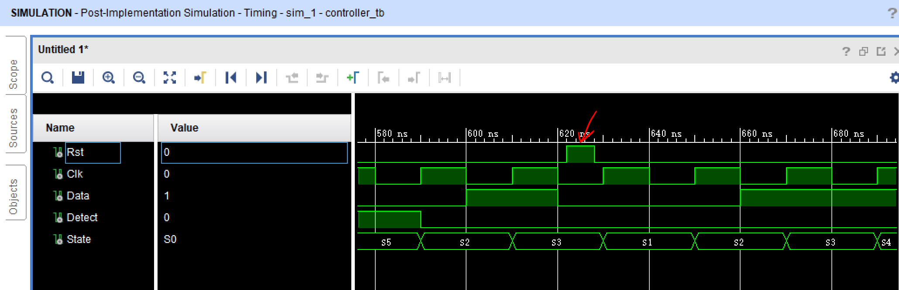

The second case shows that the reset signal is synchronous. From the figures, we can find the reset signal is set to be HIGH within a half clock period. And it goes back to LOW before the next rising edge of clock signal. Thus, in this case, nothing happens. We can check the current state machine to verify that.

### Case 3 (Functional Simulation)

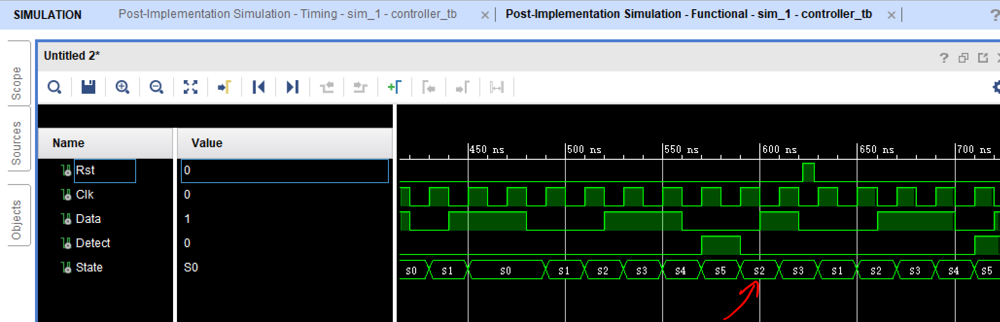

### Case 3 (Timing Simulation)

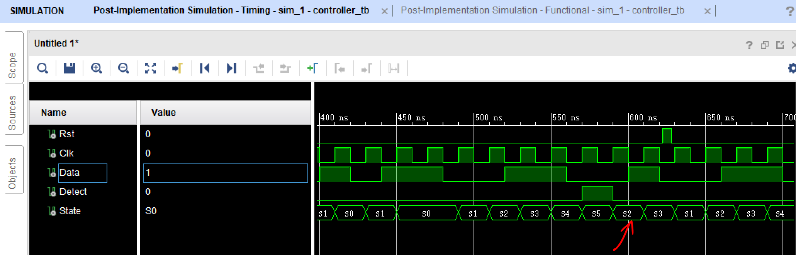

The third case shows the overlapping. After one sequence is detected, we can see from the signal `Data` that another '0' is read. Because the sequence begins with two '0' and also ends up with one '0', when another '0' comes, it will not go back to the initial state which shows no bits matched. Instead, the state changes to `s2`, which tells us there has been two bits matched already.

### Case 4 (Functional Simulation)

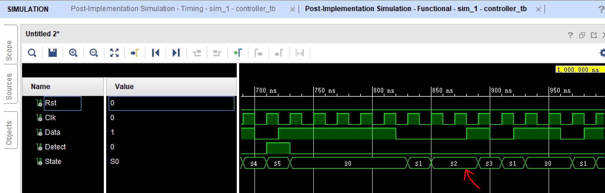

### Case 4 (Timing Simulation)

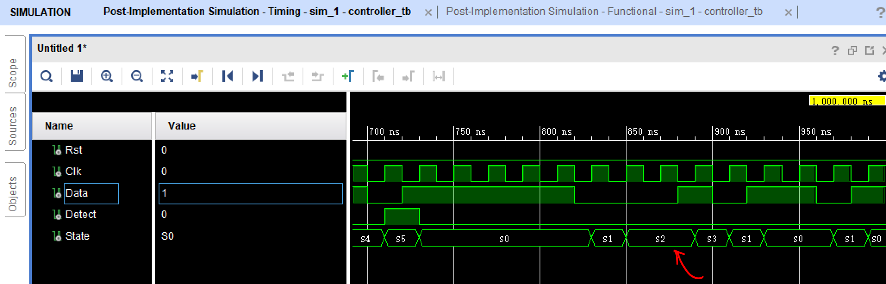

The last case shows another corner case. In this case, 3 consecutive '0' are inputted. Thus, it will lead to a mismatch when the third '0' comes. However, the state remains to be `s2` correctly because the two most recent bits are "00", which matches the first two bits in the target sequence.

### Function Simulation

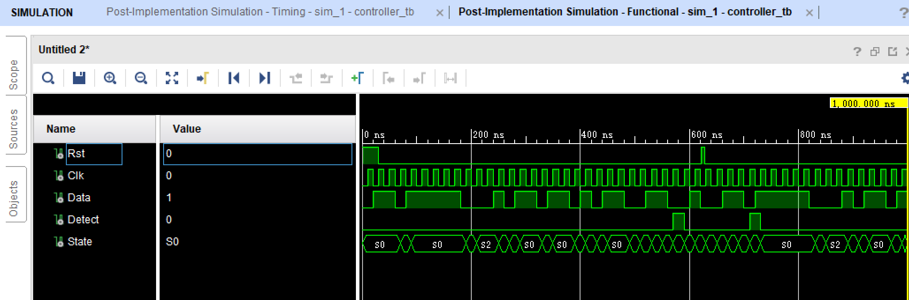

### Timing Simulation

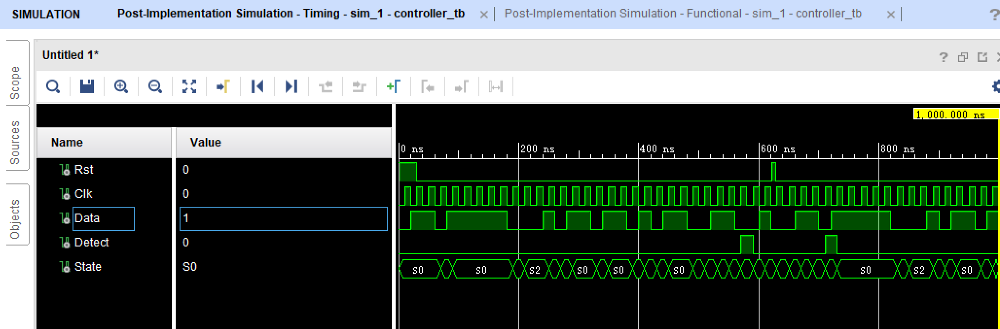

I also put the figures of the whole simulation to show the tabs of function and timing.

In this project, we can hardly see the delay in timing simulation even it is zoomed in to 1 ps (in the following figure). Perhaps, it is some features in Vivado regarding the FSM. Anyway, I have not find the solution yet.

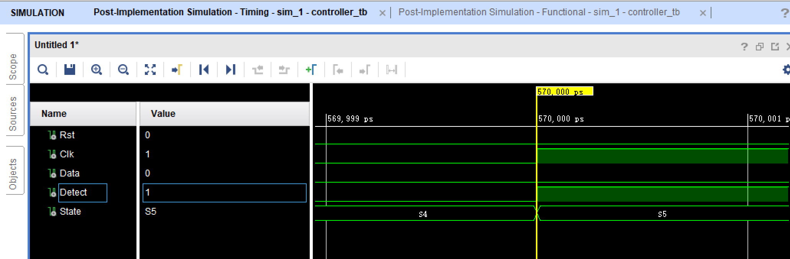

## Resource Utilization

Since the down counter shares a common basic architecture with the up counter, they have the same resource utilization.

|                              | Synthesis stage    | Place and Route stage |
| :--------------------------- | :----------------- | :-------------------- |
| LUT and FF pairs usage       | 22 LUTs and 58 FFs | 15                    |
| IOB usage                    | 26                 | 26                    |
| RAM/DSP blocks used (if any) | 0                  | 0                     |

## Speed of the design

| Setup                        |          | Hold                         |          | Pulse Width                              |          |
| :--------------------------- | :------- | :--------------------------- | :------- | :--------------------------------------- | :------- |
| Worst Negative Slack (WNS):  | 7.724 ns | Worst Hold Slack (WHS):      | 0.190 ns | Worst Pulse Width Slack (WPWS):          | 4.500 ns |
| Total Negative Slack (TNS):  | 0.000 ns | Total Hold Slack (THS):      | 0.000 ns | Total Pulse Width Negative Slack (TPWS): | 0.000 ns |
| Number of Falling Endpoints: | 0        | Number of Falling Endpoints: | 0        | Number of Falling Endpoints:             | 0        |
| Total Number of Endpoints    | 20       | Total Number of Endpoints    | 20       | Total Number of Endpoints                | 22       |

Critical path delay: 2.276 ns

Maximum clock frequency: 439.367 Hz

Latency: 1 clock cycle