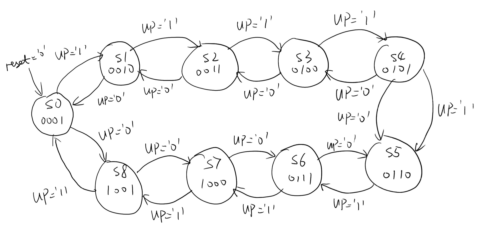
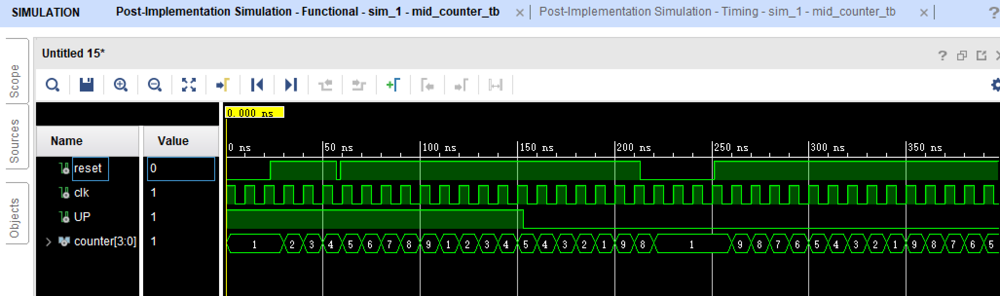
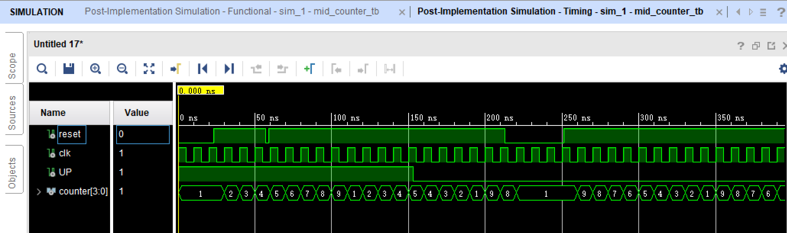

# EL6463 Advanced Hardware Design

## Midterm

Name: Chen Shen

netID: cs5236

----

## FSM Diagram

## Corner Cases

### Case 1 (Functional Simulation)

### Case 1 (Timing Simulation)

The first case shows the function of `reset`.

As is said in the specification, when the `reset` signal is LOW, the counter should output `1`, which can be seen in the figure.

Besides, since `reset` is synchronous, we can see that the counter will change only at a rising edge of clock signal `clk`.

### Case 2 (Functional Simulation)

### Case 2 (Timing Simulation)

The second case also shows a part of synchronous feature.

We can see that `reset` is LOW within a clock period.
Because it is synchronous, nothing happened to the output signal `counter` at that moment.

### Case 3 (Functional Simulation)

### Case 3 (Timing Simulation)

The third case shows the behavior when `UP` changes.

From the figures, we can find the counter began counting down after `UP` is LOW.
This also happened at the rising edge of clock signal.

### Case 4 (Functional Simulation)

### Case 4 (Timing Simulation)

The last case is just the result when normally working.

We can see that if it counted down to 1, it would start from 9 again, which meets the specification.

### Function Simulation

### Timing Simulation

I also put the figures of the whole simulation to show the tabs of function and timing.

In this project, since there is not so much computation, they seem to be similar to each other.

## Resource Utilization

Since the down counter shares a common basic architecture with the up counter, they have the same resource utilization.

|                              | Synthesis stage    | Place and Route stage |
| :--------------------------- | :----------------- | :-------------------: |
| LUT and FF pairs usage       | 26 LUTs and 41 FFs | 6                     |
| IOB usage                    | 24                 | 23                    |
| RAM/DSP blocks used (if any) | 0                  | 0                     |

## Speed of the design

| Setup                        |          | Hold                         |          | Pulse Width                              |          |
| :--------------------------- | :------- | :--------------------------- | :------- | :--------------------------------------- | :------- |
| Worst Negative Slack (WNS):  | 5.548 ns | Worst Hold Slack (WHS):      | 0.114 ns | Worst Pulse Width Slack (WPWS):          | 4.500 ns |
| Total Negative Slack (TNS):  | 0.000 ns | Total Hold Slack (THS):      | 0.000 ns | Total Pulse Width Negative Slack (TPWS): | 0.000 ns |
| Number of Falling Endpoints: | 0        | Number of Falling Endpoints: | 0        | Number of Falling Endpoints:             | 0        |
| Total Number of Endpoints    | 58       | Total Number of Endpoints    | 58       | Total Number of Endpoints                | 30       |

Critical path delay: 4.452 ns
Maximum clock frequency: 224.618 Hz